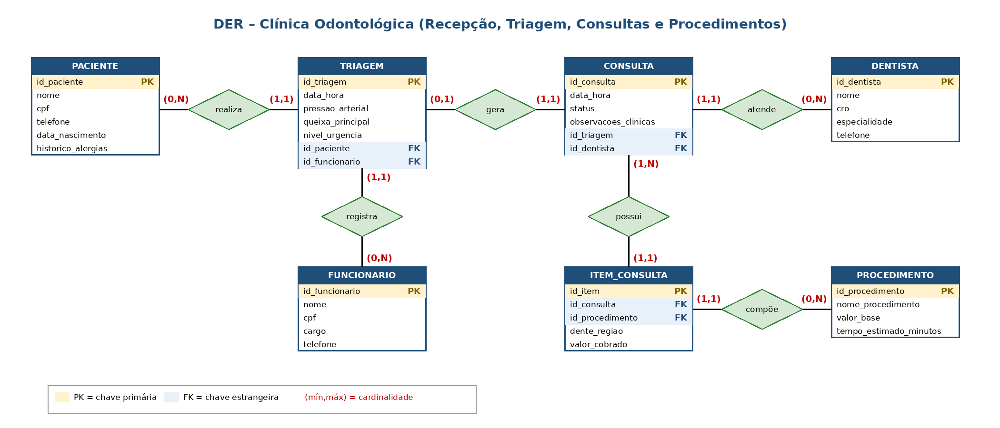

# 🦷 Banco de Dados – Clínica Odontológica

Modelagem e implementação de um banco de dados relacional para uma clínica odontológica, cobrindo todo o fluxo do paciente: **recepção → triagem → consulta → procedimentos**.

Trabalho da disciplina de Banco de Dados – Faculdade Estácio, Polo Lourdes.

## 📐 Modelo (DER)

O modelo tem **7 entidades**:

| Entidade | Função |
|---|---|
| `PACIENTE` | Pessoa atendida (CPF único, histórico de alergias) |
| `FUNCIONARIO` | Colaborador da recepção que registra a triagem |
| `TRIAGEM` | Avaliação prévia: pressão arterial, queixa e nível de urgência |
| `DENTISTA` | Profissional que atende (CRO único) |
| `PROCEDIMENTO` | Catálogo de serviços com valor base e tempo estimado |
| `CONSULTA` | Atendimento do dentista, originado de uma triagem |
| `ITEM_CONSULTA` | Tabela associativa: resolve a relação N:N entre consulta e procedimento |

### Relacionamentos e cardinalidades

| Relacionamento | Cardinalidades |
|---|---|
| PACIENTE realiza TRIAGEM | (0,N) / (1,1) |
| FUNCIONARIO registra TRIAGEM | (0,N) / (1,1) |
| TRIAGEM gera CONSULTA | (0,1) / (1,1) |
| DENTISTA atende CONSULTA | (0,N) / (1,1) |
| CONSULTA possui ITEM_CONSULTA | (1,N) / (1,1) |
| PROCEDIMENTO compõe ITEM_CONSULTA | (0,N) / (1,1) |

## 🧩 Destaques técnicos

- Chaves primárias e estrangeiras nomeadas (`pk_`, `fk_`, `uq_`, `ck_`).
- `UNIQUE` em CPF (paciente e funcionário), CRO (dentista) e `id_triagem` na consulta (uma triagem gera no máximo uma consulta).
- `CHECK` para cargo, nível de urgência, status da consulta e valores não negativos.
- Tabela associativa `ITEM_CONSULTA` guardando `dente_regiao` e `valor_cobrado`, que pertencem ao par consulta–procedimento.

## ▶️ Como executar

Requisitos: MySQL ou MariaDB (testado com XAMPP, MariaDB 10.4).

1. Inicie o MySQL (por exemplo, pelo XAMPP).
2. Abra o phpMyAdmin (`http://localhost/phpmyadmin`) ou outro cliente SQL.
3. Execute os arquivos `parte1_recepcao_triagem.sql` e `parte2_consultas_procedimentos.sql`, nessa ordem. Eles criam o banco, as tabelas na ordem correta, inserem os dados de teste e rodam uma consulta de conferência.

O cenário de teste simula uma paciente chegando, passando pela triagem e realizando **dois procedimentos** com a dentista. A consulta final deve retornar 2 linhas.

## 🛠️ Ferramentas

MySQL/MariaDB · XAMPP · VS Code · draw.io / diagramas

## 👥 Autores

- Wadson Matos Lopes de Faria
- Eduardo Pereira Neves da Silva

> Todos os dados de exemplo (nomes, CPFs, telefones) são fictícios.
